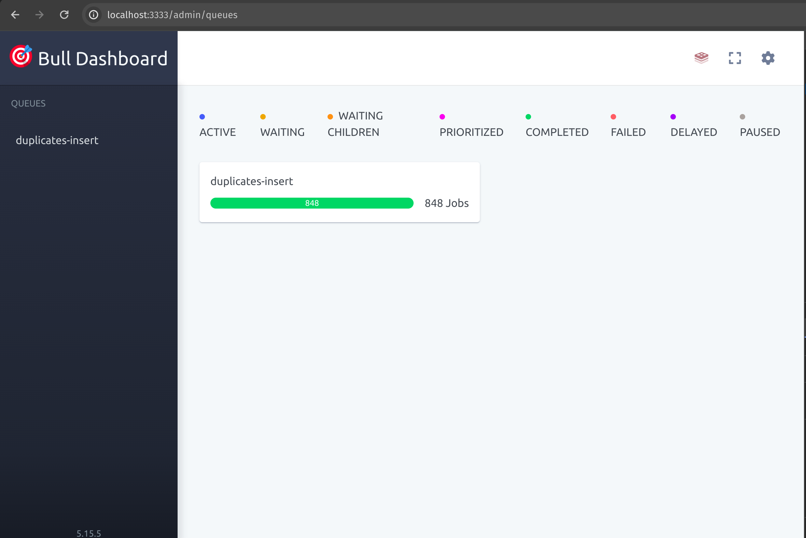

# Getting started

## What is this repo for?
This repo was developed in only one day and it implements a solution for [requirements](./requirements.pdf).

## Requirements
In order to run this application you must have `Docker` and `Docker Compose` installed. Otherwise deal with manual installation for nodejs, mysql and redis.

Make sure there are no processes running on the following ports: 3333, 3306 and 6379.

Please extract the file ```db-data.zip```.

## Running application
Simply run `docker compose up`. If it does not work, try running `docker-compose up`, it depends on how up to date you are with this specific engine.

After running this command, the following log will prompt: `[NestApplication] Nest application successfully started`

It means it is already running and reachable at: http://localhost:3333

# API
The application follows REST principles, also including metadata for linked resources within `@links` attribute. 

## Dashboard
The solution provided was not so simple an reduces response time dramatically as long as extinguish downtimes during its procedure. For more details [click here](#solution).

In order to watch all executions, you can do it looking at the running terminal or for a better experience access http://localhost:3333/admin/queues.



## Endpoints

### GET /duplicates

This endpoint returns a list of people who have duplicates in the system.

```json
{
  "total": 11,  // Total number of people with duplicates
  "data": [
    {
      "person_id": 1,
      "person_name": "Schmied",
      "person_vorname": "Cefas",
      "duplicates_count": 1,  // Number of duplicates for this person
      "@links": [
        {
          "rel": "self",
          "path": "/persons/1/duplicates"  // Link to details for this person's duplicates
        },
        {
          "rel": "person",
          "path": "/persons/1"  // Link to details for this person
        }
      ]
    },
    // ... other entries with duplicates information
  ]
}
```

### GET /persons/:id
This endpoint retrieves the details of a specific person identified by their ID.

Path Parameter:

- `:id`: The unique identifier of the person.

```json
{
  "id": 1,
  "name": "Schmied",
  "vorname": "Armin",
  "email": "support@email.de",
  "strasse": "Maximilianstrasse. 9",
  "plz": "75172",
  "land": "Deutschland",
  "zusatz": "",
  "telefonprivat": "",
  "details": {
    "id": 1,
    "person_id": 1,
    "geburtsdatum": "1986-05-01T00:00:00.000Z"
  }
}
```

### GET /persons/:id/duplicates
This endpoint retrieves the details of the duplicate entries for a specific person identified by their ID.

Path Parameter:

- `:id`: The unique identifier of the person.

```json
{
  "total": 1,  // Total number of duplicates for this person
  "data": [
    {
      "id": 4,
      "person_id": 1,
      "criteria": "EMAIL",  // Criteria for identifying the duplicate (PRIVATE-PHONE, EMAIL and NAME-AND-ADDRESS)
      "duplicate_person_id": 1447,
      "duplicate_person": {
        "id": 1447,
        "name": "Smith",
        "vorname": "Superuser",
        "email": "Superuser@email.de",
        "strasse": "",
        "plz": "",
        "land": "",
        "zusatz": "",
        "telefonprivat": ""
      },
      "@links": [
        {
          "rel": "self",
          "path": "/persons/1/duplicates"  // Link to details for this endpoint request
        },
        {
          "rel": "person",
          "path": "/persons/1"  // Link to details for the person with duplicates
        },
        {
          "rel": "duplicate_person",
          "path": "/persons/1447"  // Link to details for the duplicate person entry
        }
      ]
    }
  ]
}
```

# Solution 

The current solution is, given a routine, implement multiples assertions to find person duplicates: PRIVATE-PHONE, EMAIL, NAME-AND-ADDRESS. Which you can check directly at: [StoreDuplicitiesRoutine](src/duplicates/routines/store-duplicities.routine.ts)

Looking at the file mentioned above, all operations are chronologically well represented within the function `handleCron`.

## Greatest challenge
The greatest challenge was to process the data using streams with right technical choices and asynchronism.

Unfortunately I was forced to abandon Typeorm and rewrite everything with Knex during the synchronization routine because it does not allow data streaming. 

But right after solving this problem, I had to solve an issue with asynchronism. Even creating a wrapper to promisify streamings in order to preserve a linear flow, on('end') does not mean all rows were necessarily processed. So it was required to implement queues with BullJS and Redis and investigate a way to fix it.

The final solution was: create an promise which waits until queue.on('drained') to preserve the linear flow. Which does NOT mean the api or thread will be blocked.

## Pros
- performance: the endpoints are extremely faster
- scalability: having more data will not affect overall performance
- easy to increment: having a light query grants more flexibility to add filters, for example
- pagination: can be easily done using without compromising performance
- no downtime: this procedure "swaps" table names in order to preserve availability, making this swap with only one database operation during its final step
- customization: easier to customize data and implement more custom fields asynchronously since this data is apart.
- backups: after each execution the table `duplicate_old` remains with the previous data

## Cons
- more complexity
- more resources being used
- requires more error handling and observability since it can throw exceptions in more different stages.

## Final analysis
Since there is no way to simply calculate duplicates during a request without lacking api response time standards, and  consequently the clients, it must be somehow processed before.

It could be also added to a redis cache, but having no idea about the data load, it was decided to follow a data-intensive approach. 

This solution is still a child, there are many thing to evolve and implement, such as:
  - error handling
  - observability
  - parallelism 
  - independent workers from main application
  - pagination
  - search via query parameters
  - event driven architecture: nestjs helps a lot with this
  - documentation with OpenAPI
  - payload validation
  - unit tests
  - e2e tests
  - healthchecks
  - environment variables configuration
